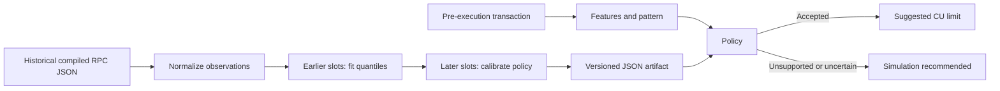

# CU Pilot

**CU Pilot learns when a separate resource-estimation simulation is unnecessary.**

A local Python and TypeScript integration for controlled families of Solana transactions.
It fits paired compute-unit and loaded-account-data quantiles, checks their joint resource
exceedance on later observations, and actually simulates when a released profile cannot
be trusted. The application keeps responsibility for validation, signing, and sending.

This is an experimental integration, **not a production-validated model**. The library
prepares unsigned messages; it never signs or submits transactions. Local integration tests
use ephemeral test keys and a private local runtime only. No customer or demand claim is made.

## Autonomous payout reference

The [payout reference application](docs/payouts.md) adds an actual local Solana program,
an immutable owner-approved test-token queue, a learned resource planner, a resumable
executor and a small browser interface. CU Pilot remains the reusable unsigned core;
the application owns local signing and submission. Linux and Windows WSL commands
build the program, collect its workload, train/calibrate, explicitly qualify a local
artifact and run real transfers plus baseline/ablation reports.

```sh
bash scripts/payouts.sh bootstrap
bash scripts/payouts.sh build
bash scripts/payouts.sh test
bash scripts/payouts.sh start
bash scripts/payouts.sh collect --groups 80
bash scripts/payouts.sh train
bash scripts/payouts.sh qualify
bash scripts/payouts.sh benchmark
bash scripts/payouts.sh demo
```

The page opens at `http://127.0.0.1:8787`. The runtime, keys and test assets are
isolated and local. See the application guide for foreground WSL operation,
recovery, safe reset, measured evidence and limits.

## Integrated resource workflow

Python 3.11+ and Node 24+ are required for both language runtimes. The Python SDK is
Solders 0.29; TypeScript uses Solana Kit 8.3. See the committed lockfiles.

```sh
uv sync --locked --group dev
npm --prefix typescript ci
npm --prefix typescript test
npm --prefix typescript run build

# Fully offline: real SDK serialization, explicitly synthetic replay measurements.
uv run python examples/shadow_replay.py
uv run cu-pilot shadow artifacts/shadow/requests.jsonl artifacts/shadow/events.sqlite --replay
# The same invocation resumes/idempotently deduplicates the existing collection.
uv run cu-pilot shadow artifacts/shadow/requests.jsonl artifacts/shadow/events.sqlite --replay
uv run cu-pilot export-shadow artifacts/shadow/events.sqlite artifacts/shadow/audit.jsonl
uv run cu-pilot preparation-report artifacts/shadow/events.sqlite
uv run cu-pilot export-shadow artifacts/shadow/events.sqlite artifacts/shadow/observations.jsonl --training-source simulation --evidence-origin synthetic
uv run cu-pilot evaluate-resources artifacts/shadow/observations.jsonl artifacts/shadow/evaluation.json
uv run cu-pilot train-resources artifacts/shadow/observations.jsonl artifacts/shadow/model.json
```

Training produces a **candidate**, never an active release. Shadow collection always
simulates, persists the prediction before its label, and records zero actual avoided calls.
Use separate datasets for simulation and historical execution, and for each evidence origin.
Synthetic examples cannot justify a production release.

The application flow is:

```text
builder → authoritative serialized message → SDK decode and budget placeholders
        → features + exact message identity → local artifact and lifecycle checks
        → accepted limits OR actual high-budget simulation OR unresolved error
        → unsigned prepared message → caller validation/signing/sending
```

Python exposes `cu_pilot.integration.estimate_resources`, `EstimationContext`,
`cu_pilot.shadow.collect_shadow`, `ObservationStore`, `ResourceEstimator`, and
`ProfileRegistry`. TypeScript exposes `estimateResources`, the Kit builder adapter, portable
profile decisions, and exact-message verification. Prediction needs no prediction server.
An accepted profile uses cached deployment checks; v0 lookup reads and sampled controls
remain explicit overhead. Old CU-only artifacts cannot authorize dual-resource skipping.

Read [integration and collection](docs/integration.md), [joint resource model](docs/resource-model.md),
[TypeScript](docs/typescript.md), [profile operations](docs/lifecycle.md), and
[real local runtime tests](docs/local-runtime.md) for complete commands and limitations.
The [verification report](docs/verification.md) records test results, measured costs,
and the remaining production-validation boundary.
The [review corrections](docs/review-corrections.md) document policy consistency
fixes and the TypeScript control-journal compatibility change.

`cu-pilot estimate-resources transaction.base64 --context context.json` uses the endpoint in
`CU_PILOT_RPC_URL` and returns `accepted_prediction`, `simulation_success`, or `unresolved`.
No model or released profile means simulation. Use `--registry`, `--profile`, and optionally
`--model` for released profiles. `--force-simulation` overrides skipping. Keep URLs in the
environment. The integration preserves preflight and business-validation policy.

## CU-only compatibility workflow

The original CLI/API and artifact below remain available for research compatibility. Their
`predict` command is a recommendation only; use the integrated resource path above in a builder.

## Quick start

Install [uv](https://docs.astral.sh/uv/getting-started/installation/), then from this repository:

```sh
uv sync --locked --group dev
uv run cu-pilot demo
uv run cu-pilot predict artifacts/demo/transaction.json artifacts/demo/model.json --context synthetic-demo-v1 --current-slot 1002000
uv run cu-pilot serve artifacts/demo/model.json
```

The demo writes an ignored dataset, JSON model, input transaction, and JSON/Markdown
evaluation reports under `artifacts/demo/`. It is entirely offline. The API listens at
`http://127.0.0.1:8000`; interactive request documentation is at `/docs`.

In another terminal, try the demo request:

```sh
curl -X POST http://127.0.0.1:8000/predict -H 'Content-Type: application/json' --data-binary @artifacts/demo/request.json
```

The synthetic scenario has two stable patterns and one that becomes more expensive.
With the default policy, the stable patterns qualify and the drifting one falls back.
Run the command to inspect the full comparison; these numbers are deliberately synthetic.

## What is implemented

- Compiled JSON parsing for legacy, v0 (including resolved lookup addresses), and v1.
- Typed transaction, feature, observation, label, prediction, and model schemas.
- Deterministic patterns with instruction discriminators, ordered programs, account roles,
  account aliasing, data sizes, and heap configuration.
- Per-pattern p95/p99 baselines with a margin, slot-separated calibration, support checks,
  an observed-risk bound, freshness checks, and conservative fallback reasons.
- Evaluation against fixed-max, global p99, ungated per-pattern p95/p99, and always-simulate.
- Explicit read-only RPC collection and simulation commands, a CLI, and an inference API.
- Offline parser, policy, RPC failure, API, CLI, and evaluation regression tests; CI and locked dependencies.

The original compatibility estimator predicts **CU only**. v1 inputs recommend simulation because
they also need a validated loaded-account-data limit. Legacy/v0 inputs with a restrictive
explicit loaded-data cap also fall back. The simulation helper returns both resources when
the node supplies them and requires both for v1.

## Data to decision



`meta.computeUnitsConsumed` supplies historical CU labels. Labels, execution logs, inner
instructions, balances, slot, signatures, and fees are not predictive features.
The observation slot is used for ordering and freshness. Caller-selected `context` scopes
a model to a cluster, runtime/program deployment, and workload policy. Change it after a
relevant deployment or runtime change. This original compatibility path does not use the
deployment watcher provided by the integrated resource workflow.

For data contracts and assumptions, see [data flow](docs/data-flow.md),
[patterns](docs/patterns.md), [model policy](docs/model.md), and [research](docs/research.md).

## Real data workflow

Start with a small, explicitly chosen list of public transaction signatures, one per line.
The collector accepts at most 100 per invocation. Use an RPC that faithfully returns v1
transaction configuration, finalized data, and CU metadata. No live RPC is needed for tests.

```sh
# Bash: keep provider credentials in the environment, never in files committed to git.
export CU_PILOT_RPC_URL='https://api.devnet.solana.com'
uv run cu-pilot collect signatures.txt data/observations.jsonl --context devnet-deployment-001
# Or normalize compiled getTransaction responses exported as one JSON object per line:
uv run cu-pilot normalize data/raw.jsonl data/observations.jsonl --context devnet-deployment-001
uv run cu-pilot evaluate data/observations.jsonl --output artifacts/evaluation.json --simulation-ms 100
uv run cu-pilot train data/observations.jsonl artifacts/model.json
```

PowerShell environment equivalent: `$env:CU_PILOT_RPC_URL='https://api.devnet.solana.com'`.
Use one context and one provenance source per dataset. Preserve failed and missing-label
observations for auditing; they do not become successful training labels. Duplicate record
IDs cannot inflate support. Larger datasets are local, ignored, and outside this first pass.

Evaluate before training a release artifact. Evaluation reserves the latest 20% of slots
for testing and splits development data again into fitting/calibration windows. The final
`train` command uses its whole input for fit/calibration; it does not preserve an external
test set for later re-evaluation. Keep that set separately when comparing releases.

## Using fallback

`predict` and `POST /predict` return `simulation_recommended`, `reason`, `explanation`,
support counts, and a CU limit only when accepted. A recommendation does not make a network
call. The integration owns the transaction builder and invokes simulation on that same
transaction when requested; the API cannot pair an arbitrary JSON description with wire bytes.

For legacy/v0 prediction, include a valid `SetComputeUnitLimit` placeholder **before**
extracting features or collecting training observations. Apply a recommendation by replacing
its value. Adding a budget instruction afterward changes the shape and CU cost; transactions
without the placeholder cannot skip simulation. Any other shape change needs a new prediction.

Prepare high-budget simulation bytes with your Solana SDK (including nonzero CU and
loaded-data limits for v1), serialize to base64 in a local text file, then:

```sh
uv run cu-pilot simulate data/prepared-transaction.base64 --version 1
```

This only calls `simulateTransaction`, with signature verification disabled. By default it
replaces the blockhash; use `--no-replace-recent-blockhash` for durable nonce workflows.
It does not increase budgets or change bytes itself. A failed simulation, missing measurements,
or a margin above a protocol limit is an error, never a usable partial estimate. Inspect
errors, then rebuild with the returned limits in the calling application. Simulation is a
resource check at a particular state and commitment, not a guarantee of later execution.
The helper detects the wire version and rejects a mismatched explicit version. Loaded-data
recommendations include the margin and round upward to 32-KiB pages.

## Evaluation and limitations

Reports include underestimation among accepted successful labeled transactions, mean/median/p95
nonnegative excess CUs, coverage, fallback rate/reasons, per-pattern metrics, and a latency
scenario. Local inference time is measured; RPC latency is an explicit assumption supplied by
`--simulation-ms`. Fallback outcomes are not fabricated from historical labels.

The default policy uses a p99 estimate plus 10%, at least 30 fitting slots and 100 calibration
slots, and a one-sided 95% Wilson upper bound below 5% on calibration underestimation. This
is an experimental policy, not a promise of a 5% production error rate. State dependence,
selection of successful historical transactions, temporal correlation, and program upgrades
can all invalidate the estimate. See [model policy](docs/model.md) before changing thresholds.

The [payout reference application](docs/payouts.md) fits state-conditioned empirical quantiles
from actual local program observations and explicitly qualifies profiles before skipping
simulation. Its held-out errors, fallback coverage and full-queue baseline comparisons are
reported without a production reliability claim. A public-network workload still needs
separate shadow collection, an agreed risk target and adequate independent evidence.

## Development

```sh
uv run ruff check .
uv run ruff format --check .
uv run mypy
uv run pytest --cov=cu_pilot --cov-report=term-missing
uv build
```

Python 3.11+; development pins 3.12. CI checks 3.11–3.13. See [contributing](CONTRIBUTING.md).
The HTTP service is intended for local use; authentication, deployment hardening, continuous
monitoring, and model rollout are future integration work. Licensed under [MIT](LICENSE).
